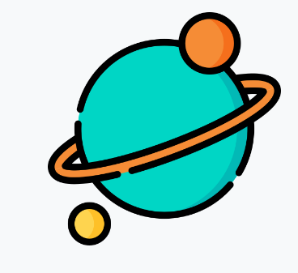

  
   

  <h3><b>Space Traveller</b></h3>

# 📗 Table of Contents

- [📖 About the Project](#about-project)
  - [🛠 Built With](#built-with)
    - [Tech Stack](#tech-stack)
  - [Key Features](#key-features)
  - [🚀 Live Demo](#live-demo)
- [💻 Getting Started](#getting-started)
  - [Setup](#setup)
  - [Prerequisites](#prerequisites)
  - [Install](#install)
  - [Run tests](#run-tests)
- [👥 Authors](#authors)
- [🔭 Future Features](#future-features)
- [🤝 Contributing](#contributing)
- [⭐️ Show your support](#support)
- [🙏 Acknowledgements](#acknowledgements)
- [❓ FAQ](#faq)
- [📝 License](#license)

# 📖 [Space Traveller] 

**[Space Traveler]** In this project we utilized real live data from the SpaceX API. We built a web application for a company that provides commercial and scientific space travel services. The application allow users to book rockets and join selected space missions.

- Here is a link to our video presentation of the project.
[Video presentation in the works]()

## 🛠 Built With 

### Tech Stack 

  
Client

  <ul>
    <li><a href="https://reactjs.org/">React.js</a></li>
  </ul>
  <ul>
    <li><a href="https://redux.js.org/">Redux.js</a></li>
  </ul>
  <ul>
    <li><a href="https://developer.mozilla.org/en-US/docs/Web/CSS">CSS</a></li>
  </ul>
  <ul>
    <li><a href="https://www.javascript.com/">JavaScript</a></li>
  </ul>

  
Space X Data API

  <ul>
    <li><a href="https://api.spacexdata.com/v4/rockets">Link to rockets data</a></li>
    <li><a href="https://api.spacexdata.com/v3/missions">Link to missions data</a></li>
  </ul>

### Key Features 

- Redux toolkit.
- Fetch Data from API.
- Render fetched API data.
- Navigation by routing.
- Interactive UI.
- Tests.

## 🚀 Live Demo 

- [Live Demo Link](https://space-traveller-fa7x.onrender.com/)

(<a href="#readme-top">back to top</a>)

## 💻 Getting Started 

### Prerequisites

In order to run this project you need to:

- Have [npm](https://www.npmjs.com/package/npm) installed in your project:
  `curl -qL https://www.npmjs.com/install.sh | sh`

### Setup

Clone this repository to your desired folder:

`git clone git remote add origin https://github.com/ClintonYounge/space-traveller`

or

`git clone git remote add origin https://github.com/ClintonYounge/space-traveller` <-- _Only if you have [SSH keys configured](https://docs.github.com/en/authentication/connecting-to-github-with-ssh/adding-a-new-ssh-key-to-your-github-account) on your GitHub account_.

or

Utilizing Github Desktop. A simple interface, thats powerful enough to simplify this process.
https://desktop.github.com/

### Install

Run the `npm install` command in your console to install all necessary dependencies.

### Run tests

To run tests, run the following command:

Run the `npm run test` command in your console to run the tests.

## 👥 Authors 

👤 ** Clinton Younge **

- GitHub: [@ClintonYounge](https://github.com/ClintonYounge)
- Linkedin: [@clinton-younge](https://www.linkedin.com/in/clinton-younge-83386a25a/)
- Twitter: [@YoungeCjay](https://twitter.com/YoungeCjay)

👤 ** Jiachun Xiang **

- GitHub: https://github.com/mpa-mxiang
- LinkedIn: https://www.linkedin.com/in/jiachun-lily-xiang-1b197213a/

(<a href="#readme-top">back to top</a>)

## 🔭 Future Features 

- Better UI and UX

(<a href="#readme-top">back to top</a>)

## 🤠Contributing 

Contributions, issues, and feature requests are welcome!

Feel free to check the [issues page](../../issues/).

(<a href="#readme-top">back to top</a>)

## ⭐️ Show your support 

If you like this project feel free to leave a star to show your support.

(<a href="#readme-top">back to top</a>)

## 🙠Acknowledgments 

We would like to give thanks to Microverse for providing us with an environment that makes us strive to grow as developers.

(<a href="#readme-top">back to top</a>)

## ❓ FAQ  

Can I clone this project ?\*\*

- Of course you can. Consider leaving a star before you fork.

Can I contribute to this project?\*\*

- Sure you can.

(<a href="#readme-top">back to top</a>)

## 📠License 

This project is [License](./LICENSE) licensed.

(<a href="#readme-top">back to top</a>)
